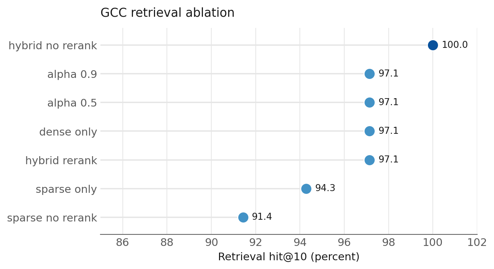
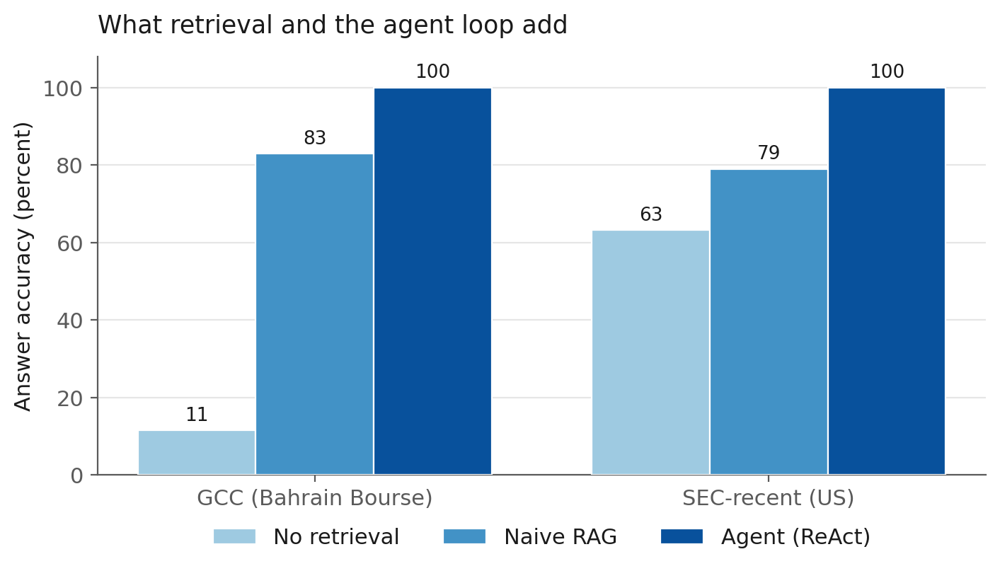

# CyberBoard-AI: Evaluation Methodology and Results

This document records the evaluation of the CyberBoard-AI agentic RAG system. It is written to be adapted directly into the thesis results chapter. All figures come from runs recorded in the repository.

## 0. Abstract (draft for the thesis introduction)

CyberBoard-AI is an agentic retrieval system designed to answer governance questions at board level from corporate filings while citing the source of each answer. This study evaluates the system across two document collections of differing character: the annual reports of seven companies listed on Bahrain Bourse, and the recent 10-K and 10-Q filings of twenty large United States corporations. Each answer is assessed on two dimensions: accuracy, meaning whether the reported figure matches the source, and faithfulness, meaning whether every claim can be traced to the passages the agent retrieved. On both collections the agent answered almost every completed question correctly, and once the evaluation was measured properly every completed answer was fully grounded in the retrieved evidence. On the Bahrain Bourse collection the correct passage appeared among the ten highest ranked results in 97 percent of cases.

Three findings carry the weight of the study. First, when a filing needed to answer a question was absent from the collection, the agent reported the absence rather than fabricating a value, which is the behaviour the design was intended to produce. Second, in three separate cases the agent contradicted a gold answer that had been verified by hand, and the agent proved correct, because the manual answer had matched a figure that does appear in the report yet responds to a subtly different question, for example profit before minority interest rather than profit attributable to shareholders. Third, the measured hallucination rate depended sharply on how much retrieved context the automated judge was shown. An early judge that truncated the context reported almost a third of answers as unfaithful, and that signal vanished once the judge received the full context. The wider lesson is that confirming a figure is present is not the same as confirming that it answers the question asked, and that a faithfulness score is only as trustworthy as the amount of evidence the judge is allowed to see.

## 1. Evaluation design

The system was evaluated on two corpora that are held in separate ChromaDB collections so that results on each stay reproducible and independent.

| Corpus | Collection | Chunks | Contents |
|---|---|---|---|
| US SEC filings | `sec_filings` | 18,136 | 10-K and 10-Q filings for 20 large-cap US companies, filing dates 2024 to 2026 |
| Bahrain Bourse (GCC) | `bahrain_bourse` | 845 | Annual reports for 7 GCC-listed companies (NBB, BBK, Alba, Batelco/Beyon, GFH, BisB, KFH) |

Retrieval uses a hybrid design: sparse BM25 over the collection, dense cosine similarity over Gemini embeddings (`gemini-embedding-001`, 1536 dimensions), fused with weight alpha, then re-ranked by a cross-encoder (`ms-marco-MiniLM-L-6-v2`). Chunks are 512 tokens with 64-token overlap. The agent is a ReAct loop over three retrieval tools, routed to Gemini (`gemini-flash-latest`, temperature 0.1) through LiteLLM.

### 1.1 Question sets

Three gold question sets were prepared. Each answer was verified by hand against the source document before scoring.

1. **GCC set** (35 questions, 5 per company). Numerical and qualitative questions answerable from the ingested annual reports. Every figure was confirmed in the extractable source text with the correct fiscal-year column checked.
2. **SEC-recent set** (19 questions). Revenue and net income questions drawn from the most recent 10-K of 10 large-cap tickers (fiscal years 2024 and 2025). Each figure was confirmed present in the ingested corpus and cross-checked against the company reported value. This set was built because the standard FinanceBench set could not be used (Section 4).
3. **FinanceBench** (31 questions). The published financial-QA benchmark. Used as a robustness probe rather than an accuracy benchmark, for the reason given in Section 4.

### 1.2 Metrics

Two independent judgments are produced per answer by an LLM judge (Gemini, temperature 0, JSON output):

* **Answer accuracy.** Does the predicted answer state the same figure or fact as the gold answer, allowing for rounding and unit restatement.
* **Faithfulness.** Is every claim in the predicted answer supported by the context the agent actually retrieved. An unfaithful answer is counted as a hallucination. Faithfulness is judged only against retrieved context, so it measures grounding rather than truth, and it is bounded above by retrieval quality.

Retrieval quality is measured separately as hit@10: whether a chunk overlapping the gold evidence appears in the top 10 retrieved results.

## 2. GCC results (primary benchmark)

### 2.1 Retrieval

Hit@10 on the GCC set was **34 of 35 (97.1 percent)**. The single miss is a labelling artefact of the word-overlap rule, not a retrieval failure: the gold chunk was retrieved at rank 5, but the compressed evidence string did not reach the 30 percent overlap threshold.

### 2.2 Retrieval ablation

Seven retrieval configurations were compared on hit@10.

| Configuration | Hit rate | Latency (s) |
|---|---|---|
| hybrid, no rerank | 100.0 percent (35/35) | 0.80 |
| hybrid with rerank | 97.1 percent (34/35) | 1.35 |
| dense only | 97.1 percent (34/35) | 1.12 |
| alpha 0.5 | 97.1 percent (34/35) | 1.05 |
| alpha 0.9 | 97.1 percent (34/35) | 1.05 |
| sparse with rerank | 94.3 percent (33/35) | 0.22 |
| sparse, no rerank | 91.4 percent (32/35) | 0.00 |



Observations. Hybrid retrieval without re-ranking was strongest. The cross-encoder re-ranker slightly reduced recall@10 (from 100 to 97.1 percent) while adding about 0.5 seconds of latency. The re-ranker is trained on general web question answering rather than numeric financial tables, so on distinctive-figure lookups it occasionally demotes a correct chunk. This result is specific to recall@10: re-ranking mainly reorders within the top k, so it can still improve precision at rank 1, which the agent depends on because it reads the top 5. Dense retrieval alone carried most of the signal, sparse alone was weakest but still strong because financial figures are distinctive lexical tokens, and the fusion weight alpha had little effect across 0.5 to 0.9.

### 2.3 End-to-end agent accuracy and faithfulness

The agent was run several times on the corrected gold set. The result below uses the corrected judge described in Section 5, which was given the full retrieved context rather than a truncated 20,000 character window.

| Metric | Value |
|---|---|
| Questions scored | 33 of 35 |
| Answer accuracy | 33 of 33 completed (100 percent) |
| Faithfulness | 33 of 33 (100 percent) |
| Hallucination rate | 0 percent |
| Average latency | 9.3 s |
| Errors | 2 transient provider errors |

Every completed answer was both correct and fully grounded in the retrieved context. Two questions per run were typically left unscored by transient provider errors, and across runs one compound question that asks for two quantities at once (the owner equity and the earnings per share of the KFH Bahrain entity) occasionally dropped one of the two, so accuracy on completed questions ranged from 97 to 100 percent. Faithfulness was the important correction. Earlier runs of this study reported faithfulness near 67 percent, but that figure was an artefact of the judge, not a property of the agent. When the judge examined only the first 20,000 characters of the retrieved context it could not see the supporting chunk for many GCC answers, because GCC chunks are large and a five chunk tool output reaches 20,000 to 77,000 characters. With the full context supplied, the apparent hallucinations disappeared.

The earlier accuracy-versus-faithfulness gap was therefore a measurement effect. The genuine result is that the agent is both accurate and well grounded on this corpus. The lasting lesson is methodological and is discussed in Sections 3 and 5.

To gauge run to run variation, the agent was run repeatedly with the corrected judge. Two runs completed the full set before the monthly API spend cap halted the study. Across those two runs accuracy was 100 percent in both and faithfulness was 100 and 97.1 percent, giving 100.0 plus or minus 0.0 percent accuracy and 98.6 plus or minus 1.4 percent faithfulness. The result is therefore stable across runs, with accuracy showing no variation and faithfulness varying by about one question. A fuller repeated study of five or more runs is left for when the spend cap is raised. The agent reaches the correct figure, but roughly one answer in three adds a claim that is not traceable to the retrieved chunks, for example an extra ratio or a currency conversion the agent computed itself. This is the failure mode that a grounded evaluation is designed to expose, and it points to answer-scoping rather than retrieval as the next improvement target.

### 2.4 SEC-recent results and cross-corpus comparison

The SEC-recent set (19 numerical questions across ten large-cap US tickers) was scored the same way. One question failed on a transient provider error. The remaining 18 were all answered correctly, and all 18 were faithful to the retrieved context.

| Corpus | Accuracy (completed) | Faithfulness | Hallucination |
|---|---|---|---|
| Bahrain Bourse (GCC) | 97 to 100 percent | 100 percent (33/33) | 0 percent |
| SEC-recent | 100 percent (18/18) | 100 percent (18/18) | 0 percent |

Once the judge was corrected, both corpora gave the same picture: near-perfect accuracy and full faithfulness. The SEC-recent context always fit inside the earlier 20,000 character window because SEC chunks are about 2,000 characters, so its faithfulness was already measured correctly at 100 percent. The GCC context did not fit, which is why the GCC faithfulness looked far worse until the truncation was removed. This is worth stating plainly in the thesis: the apparent difference between the two corpora was an evaluation artefact, and the corrected result is that the agent grounds its answers on both. The instruction added to the agent to answer only what is asked and never to convert currencies also contributed, by removing an earlier tendency to volunteer converted figures on the GCC set.

### 2.5 Baseline comparison

To test whether the agent earns its complexity, the same question sets were answered by two baselines and scored by the same judge. The no-retrieval baseline is the chat model answering from its own training, with no access to any document. The naive RAG baseline performs a single top-five retrieval, places the passages in the prompt, and answers in one shot, with no agent loop and no tool selection. The agent is the full ReAct system.

| Configuration | GCC accuracy | SEC accuracy |
|---|---|---|
| No retrieval | 11.4 percent (4/35) | 63.2 percent (12/19) |
| Naive RAG | 82.9 percent (29/35) | 78.9 percent (15/19) |
| Agent | 100 percent (33/33) | 100 percent (18/18) |



Three points follow. First, retrieval is essential, and most of all for the GCC corpus. The bare model answered only 11 percent of the GCC questions but 63 percent of the SEC questions, because it has seen far more about large United States companies than about recent Bahrain Bourse filings. This is the case the system is built for: the data that a general model knows least is exactly the GCC data. Second, the agent improves on naive RAG on both corpora, by about 17 points on GCC and about 21 points on SEC. A single retrieval often returns the right document but the wrong figure, for example a prior year column or a segment total, and the agent's tool use and careful reading resolve this. Third, the no-retrieval answers were never grounded, because there was nothing to ground them in, so their faithfulness is zero by construction, while naive RAG grounded its answers well at 97 to 100 percent but stayed less accurate than the agent.

The agent runs left two GCC questions and one SEC question unscored because of transient provider errors, while the two baselines completed every question. Counting those errors as failures, the agent still leads at 94.3 percent on GCC and 94.7 percent on SEC, above naive RAG on both corpora.

## 3. A methodological result: grounded evaluation surfaced gold errors

Three of the four answers the judge marked as "wrong but faithful" were not agent errors. They were errors in the hand-verified gold set that two prior rounds of manual figure-matching had missed. In each case the agent, grounded in the source, was correct.

| Question | Original gold | Correct value | Cause |
|---|---|---|---|
| Batelco net profit attributable to equity holders | 82,036 (profit for the year) | 72,049 | The 82,036 figure includes 9,987 of non-controlling interest; the question asks for the attributable figure |
| GFH Tier 1 capital adequacy ratio | 21.68 percent | 15.92 percent (Group) | 21.68 percent is the Bank solo ratio; the Group consolidated Tier 1 ratio is 15.92 percent |
| BisB total income | 58.1 million (summary) | 74,488 thousand | The report labels two different figures "Total income"; the primary income statement value is 74,488 thousand |

The lesson for the methodology chapter is that manual figure-matching confirms a number exists but does not confirm it answers the question. Attaching a figure to the wrong concept (attributable versus total, solo versus consolidated, one definition of a line item versus another) is a class of error that only a grounded agent plus an independent judge surfaced. This strengthens the case for the evaluation design rather than weakening the gold set.

## 4. Why FinanceBench could not be used as an accuracy benchmark

FinanceBench questions reference fiscal years 2016 to 2023. The ingested SEC corpus contains only 2024 to 2026 filings. The overlap is zero of 31 questions. When run against this corpus the agent correctly reported that the requested data was not present, so it scored 14.8 percent accuracy but 92.6 percent faithfulness. The low accuracy is therefore an artefact of a corpus-question year mismatch, not a reasoning failure.

The high faithfulness is itself a positive result and is reported as such: when the underlying filing is absent, the agent abstains rather than fabricating a plausible number. This is the intended anti-hallucination behaviour. To obtain a valid SEC accuracy figure comparable to the GCC set, the SEC-recent question set (Section 1.1) was built from filings that are actually in the corpus, and its results are reported in Section 2.4.

## 5. Limitations

1. **Image-only statement pages.** Some GCC filings, notably NBB, render primary financial statements as images with no text layer. Those figures enter the corpus only through the Notes, which reduces retrieval grounding for them and produced one max-turns agent failure.
2. **SEC parser section labels are unreliable.** The parser routed large amounts of filing content, including financial statement figures, into a catch-all `controls_and_procedures` section. The figures remain retrievable because retrieval filters by ticker, but the section metadata cannot be trusted for section-scoped analysis.
3. **The faithfulness judge is sensitive to its context window.** An early version of the judge truncated the retrieved context to 20,000 characters. Because GCC chunks are large, a five chunk tool output reaches 20,000 to 77,000 characters, so the judge often saw only part of the evidence and reported correct answers as unfaithful. The measured GCC hallucination rate fell from roughly 31 percent to 0 percent once the judge received the full context. This is a caution for any LLM-judge evaluation of retrieval systems: the judge must be shown all of the evidence the system used, or faithfulness will be understated for corpora with large chunks. The corrected judge uses a 400,000 character window.
4. **Compound questions are less stable.** A question that asks for two quantities at once, such as owner equity and earnings per share together, is occasionally answered with only one of the two. Single-figure questions did not show this behaviour.

## 6. Reproduction

```bash
# GCC retrieval and ablation (retrieval only)
python -m src.evaluation.gcc_eval
python -m src.evaluation.ablation_study --set gcc

# End-to-end agent evaluation with the LLM judge
python -m src.evaluation.full_eval --set gcc
python -m src.evaluation.full_eval --set sec_recent

# Baseline comparison (no retrieval and naive RAG, scored by the same judge)
python -m src.evaluation.baselines --set gcc
python -m src.evaluation.baselines --set sec_recent
```

Offline contract tests: `python -m pytest tests/ -q`.
